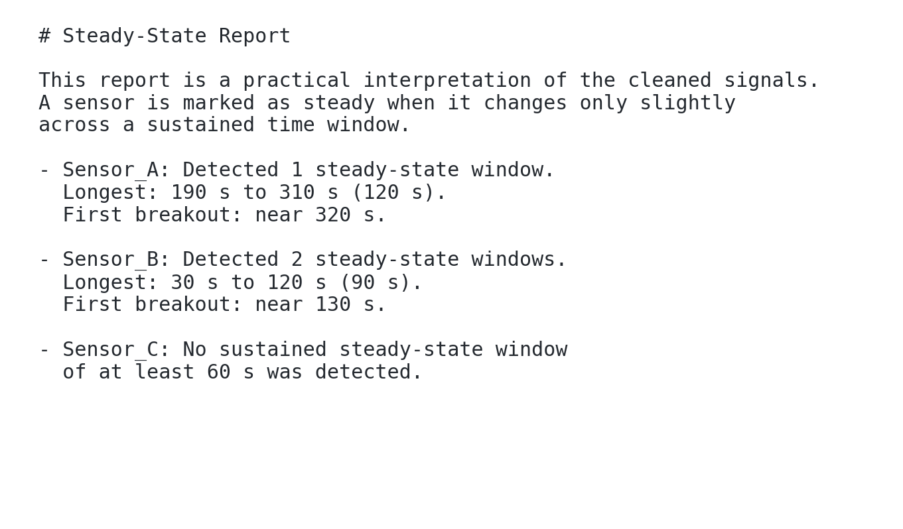

# NCDT Parallel Sensor Cleaning and Characterization Project

This repository helps a user start with noisy sensor data and get to useful
answers quickly:

- clean spike-like outliers,
- build a spline-style dense signal representation,
- generate a short human-readable summary of where each signal looks steady
  versus where it starts changing again,
- keep the whole workflow reproducible from one command,
- and, when needed, benchmark serial and MPI modes for the project report.

The codebase is modular, but the user experience is intentionally centralized:
most people should start with the `workflow` command and only drop into lower
level commands when they need something more specialized.

## Repository layout

- `src/ncdt_cleaner/` - library code and CLI
- `configs/` - default configuration files
- `examples/` - tiny tracked example inputs for first-run quick starts
- `analysis/` - generated dated session folders
- `benchmarks/` - benchmark runners and helper scripts
- `reports/` - LaTeX paper draft
- `c_openmp/` - focused C/OpenMP comparison kernel
- `tests/` - smoke-test helpers

## Quick start

From the repo root, create or activate the environment:

```bash
python3.11 -m venv .venv
source .venv/bin/activate
python -m pip install --upgrade pip
python -m pip install -e .
```

For a first run, use the tracked example dataset:

```bash
python -m ncdt_cleaner.cli workflow examples/tiny_sensor_example.csv \
  --characterize \
  --skip-benchmark
```

If you want the steady-state detector to require a different duration, use the
CLI convenience flag:

```bash
python -m ncdt_cleaner.cli workflow examples/tiny_sensor_example.csv \
  --characterize \
  --skip-benchmark \
  --steady-window-seconds 120
```

That run is designed to finish quickly and produce outputs that are easy to
inspect. The most useful files are:

- `steady_state_report.md`
- `steady_state_summary.csv`
- `steady_state_groups_summary.csv`
- `characterization_summary.csv`
- `*_rate_of_change.png`

If you want to run on your own file instead, swap in your path:

```bash
python -m ncdt_cleaner.cli workflow /path/to/noisy_input.csv --characterize --skip-benchmark
```

## Central workflow

The repo is organized around one central end-to-end entrypoint:

```bash
python -m ncdt_cleaner.cli workflow /path/to/noisy_input.csv \
  --modes serial replicated partitioned \
  --process-counts 2 4 8 16 \
  --characterize
```

For a brand-new user, the easiest path is:

1. run `workflow examples/tiny_sensor_example.csv --characterize --skip-benchmark`,
2. open the generated `steady_state_report.md`,
3. inspect the cleaned arrays and characterization JSON if you want more detail,
4. only then enable benchmarking if you care about MPI performance.

If you want the full cleaned-and-characterized outputs but not the benchmark pass:

```bash
python -m ncdt_cleaner.cli workflow /path/to/noisy_input.csv \
  --characterize \
  --skip-benchmark
```

If you already have a compatible cache and only want to rerun analysis:

```bash
python -m ncdt_cleaner.cli workflow \
  --cache-dir analysis/<session>/cache \
  --characterize
```

Typical outputs from the centralized workflow live under the session directory in
`analysis/` and include:

- `workflow/workflow_report.json`: top-level manifest of the whole run.
- `workflow/normalized_summary.json`: normalized dataset summary.
- `workflow/benchmark/benchmark_summary.csv`: strong-scaling summary table.
- `outputs/clean_serial/`, `outputs/clean_replicated/`, `outputs/clean_partitioned/`: cleaned arrays and run summaries.
- `characterization_summary.csv`: one-row-per-sensor characterization summary.
- `steady_state_summary.csv`: one-row-per-sensor steady-state summary.
- `steady_state_groups_summary.csv`: named group/system steady-state summary.
- `steady_state_report.md`: short human-readable interpretation of steady versus changing behavior.
- `*_rate_of_change.png`: per-sensor plots of cleaned signal and rate of change versus time.
- `*_characterization.json` files under the clean output directories when `--characterize` is enabled.

This means a user can start from one raw noisy file and get:

- repaired signals,
- descriptive statistics,
- spline-style dense signal representations,
- a short report saying where each signal appears approximately steady for at least a minute and when it clearly breaks out of steady-state,
- an optional group/system summary showing when all sensors in a named group are simultaneously steady,
- MPI timing studies,
- report-ready tables and plots,

without manually stitching intermediate steps together.

## Fastest path for a new user

If you just want to see the repo work end to end before trying your own data:

```bash
python -m ncdt_cleaner.cli workflow examples/tiny_sensor_example.csv --characterize --skip-benchmark
```

Then open:

1. `analysis/<latest_session>/outputs/clean_serial/steady_state_report.md`
2. `analysis/<latest_session>/outputs/clean_serial/steady_state_summary.csv`
3. `analysis/<latest_session>/outputs/clean_serial/steady_state_groups_summary.csv`
4. `analysis/<latest_session>/outputs/clean_serial/characterization_summary.csv`
5. `analysis/<latest_session>/outputs/clean_serial/sensors/*_rate_of_change.png`

That sequence gives you, in order:

- a short plain-English interpretation,
- a table of steady windows and breakout times,
- a table showing when a whole sensor group or the full system was steady at the same time,
- a table showing which spline/interpolation method was used,
- and plots that show where the signal slope becomes large or remains near zero.

Here is the style of steady-state summary the quick-start generates:



## What "steady-state" means here

The steady-state summary is intentionally practical rather than overly academic.
For each cleaned sensor:

- the code looks at a sustained time window, defaulting to 60 seconds,
- checks whether the signal slope, end-to-end change, and local variation all stay small enough,
- groups those windows into longer steady segments,
- and reports where the signal appears steady versus where it starts changing again.

This gives a new user a first-pass answer to questions like:

- "Was the system stable for at least a minute?"
- "When did the sensor stop sitting flat and start moving again?"
- "Which sensors never really reached a quiet steady period?"

By default, the config also defines an `all_sensors` group so the workflow can
answer a stricter system-level question:

- "When were all of the tracked sensors steady at the same time?"

You can define additional named groups in the config when only certain sensors
should be analyzed together as one subsystem.

## Running on GB-scale data

For large raw files, the practical split is:

- use `workflow` when your goal is data analysis,
- use the scripts in `benchmarks/` when your goal is performance analysis.

### Recommended large-data command

If your main goal is to clean a large dataset, get spline-style outputs, and
produce steady-state summaries, start with:

```bash
python -m ncdt_cleaner.cli workflow /path/to/large_input.csv \
  --characterize \
  --skip-benchmark
```

That avoids repeated timing runs while you are still trying to understand the
data itself.

### When to use `workflow`

Use `workflow` when you want one command to:

- inspect the raw file,
- build or reuse the cache,
- clean the sensor channels,
- generate characterization outputs,
- classify per-sensor and group/system steady-state,
- and leave behind one manifest you can revisit later.

This is the right default for brand-new users and for most real-data analysis.

### When to use benchmark scripts

Use `benchmarks/run_scaling.py`, `run_weak_scaling.py`, or the Slurm helper
scripts when you are no longer asking "what is my data doing?" and instead
asking:

- "How does runtime scale?"
- "Which MPI decomposition performs better?"
- "Where do communication and gather overheads dominate?"

Those scripts are for performance studies and paper figures, not the first pass
on a newly arrived dataset.

### Storage and cache guidance

On GB-scale data, cache reuse matters. The workflow writes a normalized binary
cache under the session directory so later runs do not need to re-parse the raw
CSV/XLSX file every time.

- First large run: let `workflow` build the cache.
- Later reruns on the same input/config: reuse it with:

```bash
python -m ncdt_cleaner.cli workflow \
  --cache-dir analysis/<session>/cache \
  --characterize \
  --skip-inspect \
  --skip-benchmark
```

This is usually much faster than rereading the raw file from scratch.

### Login node vs compute node

Use the login node for:

- reading docs,
- editing code,
- very small example runs,
- report generation,
- lightweight smoke tests.

Move to a compute node or submit a batch job when:

- the raw file is large enough that parsing/cleaning is no longer quick,
- you want MPI runs with many ranks,
- you want repeated benchmarks,
- or you are generating paper-scale performance results.

For larger MPI studies on shared systems, prefer the Slurm scripts in
`benchmarks/` over heavy interactive runs.

### Cleanup advice

Large runs can leave many dated session directories under `analysis/`. That is
useful for reproducibility, but it also consumes space.

Recommended cleanup habit:

1. Keep the session directories tied to results you care about.
2. Delete old exploratory sessions once the important artifacts have been kept elsewhere.
3. Reuse caches intentionally rather than keeping many duplicate sessions for the same input.

If you are preparing a paper or audit trail, keep the benchmark and
report-producing sessions. If you are only exploring thresholds or testing
quick ideas, it is reasonable to prune older sessions regularly.

## Reproducible paper workflow

The paper results in `reports/` come from the same code paths described above.
The recommended sequence is:

1. Run the centralized workflow on a representative noisy input to verify the raw-data-to-cleaned-output path:

```bash
python -m ncdt_cleaner.cli workflow /path/to/noisy_input.csv \
  --modes serial replicated partitioned \
  --process-counts 2 4 8 16 \
  --characterize
```

2. Run the stronger MPI studies from `benchmarks/` when you need paper-grade scaling figures:

```bash
python benchmarks/run_scaling.py --input-file /path/to/noisy_input.csv
python benchmarks/run_weak_scaling.py
```

3. Regenerate the combined report figures:

```bash
.venv/bin/python reports/make_parallel_scaling_figures.py
.venv/bin/python reports/make_mpi_diagnostics_figures.py
```

4. Build the LaTeX paper in `reports/`.

This keeps the project modular while still giving users one obvious default
entrypoint for the full raw-data-to-analysis workflow.

## Intended workflow

1. **Inspect** raw files.
2. **Infer schema** and confirm or override it.
3. **Cache-build** a binary on-disk representation (`.npy`/memmap-friendly arrays + metadata).
4. **Clean** the data.
5. **Characterize** the cleaned data using cubic splines when SciPy is available, otherwise a linear fallback.
6. **Summarize behavior** into steady-state windows and breakout times.
7. **Benchmark** serial vs MPI strategies.
8. Use the generated JSON/CSV/plots in the report draft under `reports/`.

The recommended entrypoint is now:

```bash
python -m ncdt_cleaner.cli workflow /path/to/Test00.xlsx
```

This single command can:
- inspect the input,
- create the cache if needed,
- run representative serial, replicated, and partitioned clean passes,
- emit cleaned arrays and per-sensor summaries,
- emit spline-style characterization JSON when `--characterize` is used,
- emit `steady_state_summary.csv` and `steady_state_report.md` when `--characterize` is used,
- benchmark the requested process counts,
- write a consolidated `workflow_report.json`,
- emit report-friendly files such as `benchmark_summary.csv`, timing-breakdown summaries, and benchmark plots.

If you already have a cache, reuse it directly:

```bash
python -m ncdt_cleaner.cli workflow --cache-dir analysis/<session>/cache
```

For benchmark-only automation starting from a raw input file, use:

```bash
python benchmarks/run_scaling.py \
  --input-file /path/to/Test00.xlsx \
  --process-counts 2 4 8
```

This will:
- search `analysis/*_session_*/cache_metadata.json` for a matching cache,
- reuse the cache when the input file and config match,
- build a new cache automatically when no match exists,
- write benchmark outputs without requiring any manual `cache_dir` copy step.

Direct `cache-build` runs now also write a top-level machine-readable file:

```text
analysis/YYYY-MM-DD_session_<id>/cache_metadata.json
```

## Notes on file irregularities

The code never assumes:
- the time column is literally named `time`,
- all files have the same headers,
- all data are already tidy.

Instead it:
- normalizes headers,
- scores time-column candidates by name and value behavior,
- logs ambiguities,
- allows explicit CLI/config overrides.

## What the cleaning stage does

The cleaner is designed to repair local spikes and point anomalies, not to act as
a general-purpose low-pass denoiser.

- It detects suspicious points from local-window statistics.
- It can drop, clip, or replace flagged points.
- It can interpolate over missing values after repair.
- It can then pass the cleaned signal into the characterization stage.

The characterization stage is separate from cleaning on purpose:

- cleaning answers "what points should be repaired?"
- characterization answers "what smooth dense representation should be built from the cleaned signal?"
- behavior analysis answers "where does the cleaned signal look approximately steady, and where does it break out of that steady behavior?"

This distinction matters in the report because the spline step should not be
confused with the outlier-repair logic.

## Large-data design

For future many-GB/TB workflows, the code separates:
- raw ingest,
- schema inference,
- normalized cache creation,
- analysis on binary arrays.

This avoids repeated expensive CSV parsing and enables memmap-backed partitioned processing.

## MPI analysis workflow

For MPI-focused studies beyond the main `workflow` command, the repo now includes:

- `benchmarks/run_scaling.py` for corrected strong-scaling studies from a raw input or cache.
- `benchmarks/run_weak_scaling.py` for weak-scaling studies with synthetic campaigns.
- `benchmarks/slurm_strong_scaling_diagnostics.sh` for detailed timing-breakdown runs.
- `benchmarks/slurm_weak_scaling_analysis.sh` for weak-scaling batch runs.

These studies write manifests, per-repeat logs, benchmark summaries, timing-breakdown summaries, parallel-metrics summaries, and plots.

## Modularity

The repo is intentionally split so major stages can be replaced without rewriting
the whole workflow:

- Replace `cleaning.py` to change outlier detection or repair policy.
- Replace `characterize.py` to swap spline/interpolation methods.
- Replace `behavior.py` to swap steady-state heuristics or state-classification logic.
- Replace `mpi_modes.py` to experiment with a different decomposition strategy.
- Replace JSON config files under `configs/` to tune schema, cleaning, characterization, and benchmark defaults.
- Keep `workflow.py` and `cli.py` as the centralized orchestration layer that calls those modules in order.

## Report

The scientific-paper-style draft is in:

- `reports/paper.tex`
- `reports/references.bib`

## OpenMP comparison

The focused companion comparison is in:

- `c_openmp/spike_kernel.c`
- `c_openmp/Makefile`

It is intentionally a small kernel, not the full application.
